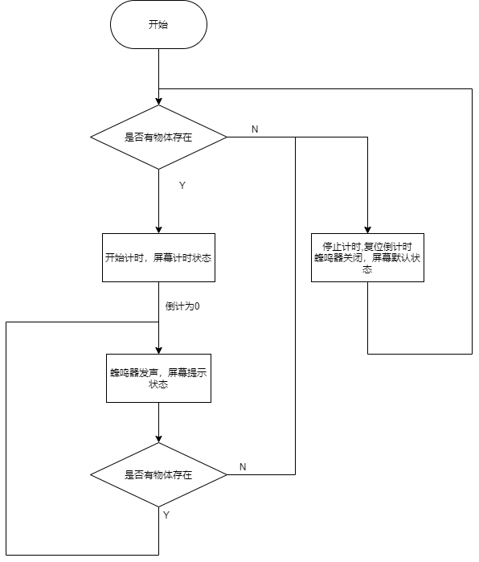

---
html:
  embed_local_images: true
---


<font size=7>**基于stm32的喝水提醒小助手**</font>
[TOC]


## 0 前言
最近看江科大的stm32教程，学到了DMA，想把之前学过的东西整合起来，恰好我经常忘记喝水，那就做个提醒喝水小助手吧。

## 1 系统分析
###1.1 场景模拟
场景模拟比较简单，当检测到物体时，启动定时器开始计时，并在屏幕上显示倒计时时间，倒计时结束时，蜂鸣器播放音乐，直到物体被拿开。

<center>

</center>

### 1.2 硬件准备
检测物体是否存在原则上用压敏电阻最为合适，但是手头恰好有超声波模块，于是用超声波AD引脚采集传感器距离。


<center>

</center>


<center> US-016超声波传感器模块</center>

</p>

>由于要做DMA+ADC的实验，所以额外加了两个其他传感器，采集数据并与超声波模块的采集数据一起打印到屏幕上。

### 1.3 代码实现

#### 1.3.1 主要框架
首先，显示界面有三个状态。通过switch选择各个界面。
```c
//主界面模式获取
tp_maininterfmode MainInterfMode(void)
{
	tp_maininterfmode mode;
	if(datacapt[PERIPHNUMB-1]>800)	mode=normal;  //默认模式
	else if(datacapt[PERIPHNUMB-1]<400)	
	{
		mode=Timekeeping;                          //计时模式
		if(delaytime==0)	mode=Timeout;          //提醒喝水模式
	}
	return mode;
}
````


<center>


</center>

>默认模式（左/上），计时模式（中），提醒喝水模式（下）。

</p>

各模式的具体操作如下
```c
//main.c

switch (MainInterfMode())
		{
			case normal:
				OLED_Clearrow(2);   //清空黄屏
				title="ADC&&DMA#TEST";  //修改标题
				resettime();    //重置倒计时到设定的时间
				once=1;
				Buzzer_delayplaycmd(CLOSE_BUZZER);  //关闭蜂鸣器
				break;
			case Timekeeping:
				if(once)    //若没有回到默认模式（normal）,则重置一次时间
				{
					resettime();
					once=!once;
				}
				title="En_TIM:";
				Buzzer_delayplaycmd(OPEN_BUZZER);    //开始计时
				OLED_Clearrow(2);
				OLED_Showtime(60,0,time_h_m_s());   //显示时间
				break;
			case Timeout:   //时间到，打印提醒界面并启动蜂鸣器
				OLED_Clear();
				OLED_ShowString(0,30,"please drink water:)",8,0);
				OLED_Refresh();
				Buzzer_playmusic();
				break;
			default:
				break;
		}
		OLEDmaininterf(title);  //将修改的标题传给界面答应函数
````

其中`time_h_m_s()`将当前倒计时（单位秒）转换为`tp_time`结构体并返回该类型的结构体。通过`OLED_Showtime()`函数在屏幕上输出`xx:xx:xx`格式的当前倒计时。

```c
//main.h


typedef struct 
{
    u8 hour;
    u8 min;
    u8 sec;
} tp_time;


//main.c

//倒计时初始值的定义
tp_time init_delaytime={.hour=0,.min=0,.sec=10};


//buzzer.c

//当前倒计时的定义
uint64_t delaytime;
````
#### 1.3.2 代码重点
##### 1.3.2.1 蜂鸣器播放音乐
和蜂鸣器相关的函数定义在`buzzer.h`以及`buzzer.c`中。
```c

//buzzer.c


//basic

//蜂鸣器初始化
void Buzzer_conf(void)
{

    //配置GPIO
    RCC_APB2PeriphClockCmd(RCC_APB2Periph_GPIOA,ENABLE);
    GPIO_InitTypeDef GPIO_InitStructure;
    GPIO_InitStructure.GPIO_Mode=GPIO_Mode_Out_PP;
    GPIO_InitStructure.GPIO_Pin=GPIO_Pin_2;
    GPIO_InitStructure.GPIO_Speed=GPIO_Speed_50MHz;
    GPIO_Init(GPIOA,&GPIO_InitStructure);
    GPIO_ResetBits(GPIOA,GPIO_Pin_2);

}

//此处通过推挽输出模式输出PWM波形
//frq:输入的频率
//duty:占空比 （0-100）
void Buzzer_pwm(const uint32_t frq,const uint16_t duty)
{
    uint32_t time;
    if(frq==1000)
        delay_us(1000);    
    else
    {
        time=10000/(uint32_t)frq;   				//因为用的delay_us()微秒级延时，精度高一点
        GPIO_SetBits(GPIOA,GPIO_Pin_2);				//所以time=10^6/frq
        delay_us(time*duty);						//duty本是一个百分数，故先将time*duty中的100在time赋值时先除以100
        GPIO_ResetBits(GPIOA,GPIO_Pin_2);			//所以time=10^4/frq
        delay_us(time*(100-duty));
    }
}

````

有源蜂鸣器与无源蜂鸣器中的“源”是指“震荡源”。有源蜂鸣器内部带震荡源，所以只要一通电就会叫。而无源内部不带震荡源,如果用直流信号无法令其鸣叫,必须用方波去驱动它。对于无缘蜂鸣器，其声音频率可控，可以做出“多来米发索拉西”的效果。如果将引脚置高电平一段时间后再置低电平一段时间，循环函数 `Buzzer_pwm()`，就可以得到特定频率的方波。

<center>

</center>

```c
//buzzer.c


//function

//以700HZ的频率，占空比2%响两声
void bootPOST(void)
{

    for(int i=0;i<2;i++)
    {
        for(int i=1;i<35;i++)
        {
            Buzzer_pwm(700,2);
        }
        delay_ms(100);
    }
    GPIO_ResetBits(GPIOA,GPIO_Pin_2);
}

//定时喝水提醒初始化函数
void Buzzer_delayplayconf(void)
{
    resettime();
    //使用TIM1定时
    RCC_APB2PeriphClockCmd(RCC_APB2Periph_TIM1,ENABLE);

    //72Mhz/7200/50000=0.2,T=1/0.2=5s,5x12=1min
    //72Mhz/7200/10000=1,T=1s,
    TIM_InternalClockConfig(TIM1);
    TIM_TimeBaseInitTypeDef TIM_TimeBaseInitStruct;
    TIM_TimeBaseInitStruct.TIM_ClockDivision=TIM_CKD_DIV1;
    TIM_TimeBaseInitStruct.TIM_CounterMode=TIM_CounterMode_Up;
    TIM_TimeBaseInitStruct.TIM_Period=10000-1;			//自动重装值
    TIM_TimeBaseInitStruct.TIM_Prescaler=7200-1;      	//预分频   
    TIM_TimeBaseInitStruct.TIM_RepetitionCounter=0;		//重复多少次申请一次更新中断
    TIM_TimeBaseInit(TIM1,&TIM_TimeBaseInitStruct);
    TIM_ClearFlag(TIM1,TIM_IT_Update);					//TIM_TimeBaseInit()每次执行后都会立刻申请一次更新中断，需要手动置零跟新中断标志位
    TIM_ITConfig(TIM1,TIM_IT_Update,ENABLE);			//使能更新中断

    NVIC_InitTypeDef NVIC_InitStruct;					//为中断函数配置优先级
    NVIC_InitStruct.NVIC_IRQChannel=TIM1_UP_IRQn;
    NVIC_InitStruct.NVIC_IRQChannelCmd=ENABLE;
    NVIC_InitStruct.NVIC_IRQChannelPreemptionPriority=0;
    NVIC_InitStruct.NVIC_IRQChannelSubPriority=0;
    NVIC_Init(&NVIC_InitStruct);

    TIM_Cmd(TIM1,DISABLE);
}

//定时开关函数
void Buzzer_delayplaycmd(BUZZERSTATE state)
{
    if(state==OPEN_BUZZER)
        TIM_Cmd(TIM1,ENABLE);
    else 
        TIM_Cmd(TIM1,DISABLE);
}
````
播放音乐原理也很简单，我们可查到对应音调的频率如下
```c
//musicdata.h

//              低7  1   2   3   4   5   6   7  高1 高2 高3 高4 高5 不发音
uc16 tone[] = {247,262,294,330,349,392,440,494,523,587,659,698,784,1000};//音频数据表

//将乐谱的音调和持续时间记下来（下面这个例子是红尘情歌）
u8 music[]={5,5,6,8,7,6,5,6,13,13,//音调
                5,5,6,8,7,6,5,3,13,13,
                2,2,3,5,3,5,6,3,2,1,
                6,6,5,6,5,3,6,5,13,13,

                5,5,6,8,7,6,5,6,13,13,
                5,5,6,8,7,6,5,3,13,13,
                2,2,3,5,3,5,6,3,2,1,
                6,6,5,6,5,3,6,1,	

                13,8,9,10,10,9,8,10,9,8,6,
                13,6,8,9,9,8,6,9,8,6,5,
                13,2,3,5,5,3,5,5,6,8,7,6,
                6,10,9,9,8,6,5,6,8
                };	

u8 time[] = {2,4,2,2,2,2,2,8,4, 4, //时间
                2,4,2,2,2,2,2,8,4, 4, 
                2,4,2,4,2,2,4,2,2,8,
                2,4,2,2,2,2,2,8,4 ,4, 

                2,4,2,2,2,2,2,8,4, 4, 
                2,4,2,2,2,2,2,8,4, 4, 
                2,4,2,4,2,2,4,2,2,8,
                2,4,2,2,2,2,2,8,

                4, 2,2,2, 4, 2,2,2, 2,2,8,
                4, 2,2,2,4,2,2,2,2,2,8,
                4, 2,2,2,4,2,2,5,2,6,2,4,
                2,2 ,2,4,2,4,2,2,12
                };

````

基于上面的函数播放音乐就很简单了：

```c
//播放音乐
uint8_t Buzzer_playmusic(void)
{
	for(uint16_t i=0;i<sizeof(music)/sizeof(music[0]);i++)	//第二层循环，播放整首歌
    {
		for(uint16_t e=0;e<((u16)time[i])*tone[music[i]]/6;e++)//第一层循环，播放单个音节
        {
			Buzzer_pwm((u32)tone[music[i]],1);
            if(datacapt[PERIPHNUMB-1]>800)             //if语句是为了在特定情况下停止播放
            {
                GPIO_ResetBits(GPIOA,GPIO_Pin_2);
                mode=normal;						
                resettime();
                OLED_Clear();
                return 1;
            }
        }
    }
    return 0;
}
````

##### 1.3.2.2 ADC+DMA 
stm32的模拟-数字转换器（Analog-Digital Converter）的基本结构如下：

当需要对多个传感器的数据进行采集的时候，（多通道模式），因为规则组存储结果的寄存器只有一个，如果不在下一个通道转换前将上个通道的转换结果保存，则上一个通道的转换结果将会被这一次的转换结果覆盖。DMA就是这个转运小助手，将数据转运到另一个存储位置。
```c
//sensor.c


//输入引脚配置函数
void GPIO_conf(void)
{   
    RCC_APB2PeriphClockCmd(RCC_APB2Periph_GPIOA,ENABLE);
    GPIO_InitTypeDef GPIO_InitStructure;
    GPIO_InitStructure.GPIO_Mode=GPIO_Mode_AIN;			//GPIO_MODE_AIN 模拟输入. 输入信号不经施密特触发器直接接入， 输入信号为模拟量 而非数字量
    GPIO_InitStructure.GPIO_Pin=GPIO_Pin_4|GPIO_Pin_5|GPIO_Pin_6;
    GPIO_InitStructure.GPIO_Speed=GPIO_Speed_50MHz;
    GPIO_Init(GPIOA,&GPIO_InitStructure);
}


//配置ADC
void ADC_conf(void)
{
    //配置ADC转换时钟
    RCC_APB2PeriphClockCmd(RCC_APB2Periph_ADC1,ENABLE);
    RCC_ADCCLKConfig(RCC_PCLK2_Div6);

    //配置转换序列
    RCC_ADCCLKConfig(RCC_PCLK2_Div6);  
    ADC_RegularChannelConfig(ADC1,ADC_Channel_4,1,ADC_SampleTime_55Cycles5);
    ADC_RegularChannelConfig(ADC1,ADC_Channel_5,2,ADC_SampleTime_55Cycles5);
    ADC_RegularChannelConfig(ADC1,ADC_Channel_6,3,ADC_SampleTime_55Cycles5);

    ADC_InitTypeDef ADC_InitStructure;
    ADC_InitStructure.ADC_ContinuousConvMode=ENABLE;			//连续转换模式使能
    ADC_InitStructure.ADC_ScanConvMode=ENABLE;					//扫描模式使能
    ADC_InitStructure.ADC_DataAlign=ADC_DataAlign_Right;		//数据右对齐（数据精度相关）
    ADC_InitStructure.ADC_ExternalTrigConv=ADC_ExternalTrigConv_None;		//不使用外部触发源
    ADC_InitStructure.ADC_Mode=ADC_Mode_Independent;			//独立模式
    ADC_InitStructure.ADC_NbrOfChannel=PERIPHNUMB;				//在扫描模式使能情况下生效，这里是通道数3
    ADC_Init(ADC1, &ADC_InitStructure);

    ADC_Cmd(ADC1,ENABLE);    //ADC转换使能

    //复位ADC校准寄存器。					
    ADC_ResetCalibration(ADC1); //重置校准
    while(ADC_GetResetCalibrationStatus(ADC1)); //等待重置完成
    ADC_StartCalibration(ADC1);  //开始校准
    while(ADC_GetCalibrationStatus(ADC1));  //等待校准完成
    ADC_SoftwareStartConvCmd(ADC1,ENABLE); //开始转换
}

void init_adc(void)
{
    GPIO_conf();
    ADC_conf();
    
    //初始化DMA
    init_dma(&ADC1->DR,datacapt,PERIPHNUMB); 
    ADC_DMACmd(ADC1,ENABLE);//开始adc触发dma转运
}

//初始化DMA
void init_dma(__IO uint32_t * PeripheralBaseAddr,uint16_t * MemoryBaseAddr,uint16_t size)
{
    dma_size=size;
    RCC_AHBPeriphClockCmd(RCC_AHBPeriph_DMA1,ENABLE);

    DMA_InitTypeDef DMA_InitStructure;
    DMA_InitStructure.DMA_BufferSize=size;
    DMA_InitStructure.DMA_DIR=DMA_DIR_PeripheralSRC;
    DMA_InitStructure.DMA_M2M=DMA_M2M_Disable;
    DMA_InitStructure.DMA_MemoryBaseAddr=(uint32_t)MemoryBaseAddr;
    DMA_InitStructure.DMA_MemoryDataSize=DMA_MemoryDataSize_HalfWord;
    DMA_InitStructure.DMA_MemoryInc=DMA_MemoryInc_Enable;
    DMA_InitStructure.DMA_Mode=DMA_Mode_Circular;
    DMA_InitStructure.DMA_PeripheralBaseAddr=(uint32_t)PeripheralBaseAddr;
    DMA_InitStructure.DMA_PeripheralDataSize=DMA_PeripheralDataSize_HalfWord;
    DMA_InitStructure.DMA_PeripheralInc=DMA_PeripheralInc_Disable;
    DMA_InitStructure.DMA_Priority=DMA_Priority_VeryHigh;
    DMA_Init(DMA1_Channel1,&DMA_InitStructure);
    
    DMA_Cmd(DMA1_Channel1,ENABLE);
}
````
## 2 代码文件

[:arrow_down: GitHub](https://github.com/fanluoqiu/study-stm32.git)

## 2 参考文章
[《基于STM32F103，用蜂鸣器播放歌曲》 作者：lintax 发布时间： 2022-07-31 18:08:19](http://t.csdn.cn/GpgSE)
[《使用STM32F103控制蜂鸣器发声播放音乐》 作者：blue@sky 发布时间： 2018-06-07 11:46:33](http://t.csdn.cn/vU2yu)
